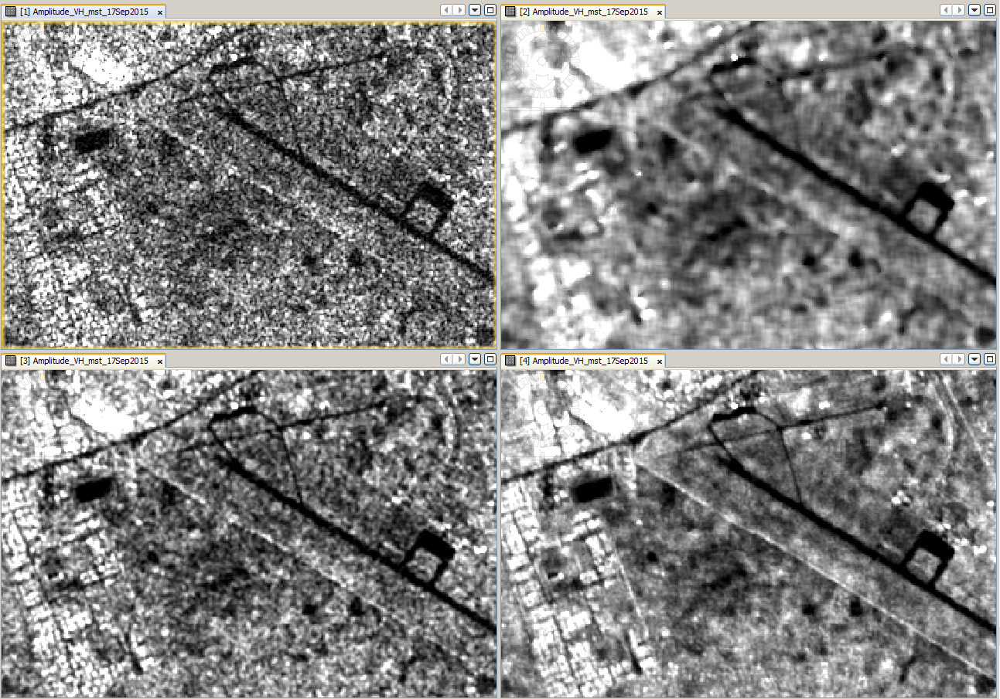

# Speckle Filter Configurations

The gee_s1_ard filters are taken from this [gee_s1_ard fork](https://github.com/LSCE-forest/gee_s1_processing/) repository. See related paper [here](https://www.mdpi.com/2072-4292/13/10/1954).

| Parameter                                         | Type  | Accepted Values | Description |
|---------------------------------------------------|-------|-------------|-----|
|speckle_filter_framework                           |string | 'MONO', 'MULTI'| Whether the speckle filter will be applied on a single image or to a termporal stack of images neighboring each image in the filtered collection|
|speckle_filter_nr_of_images                        |integer|     $i\in\mathbb{}R+$         | The number of images to be used by the multi temporal speckle filter framework
|speckle_filter                                     |string | 'BOXCAR', 'LEE', 'REFINED LEE', 'LEE SIGMA', 'GAMMA MAP'| The name of the speckle filter to use|
|speckle_filter_kernel_size                         |integer|     {$i\in\mathbb{}R+\mid i//2\neq0$}         | Size of the kernel that will be used to convolv the images.
## Speckle Filter Framework
### MONO
The MONO framework simply applies the *speckle_fiter* to the individual images of the collection.
### MULTI
The MULTI framework applies a weighted average of the *speckle_fiter* across images of a time-series to each image of the collection.

See below a quick run down of the function.  

Let:
- $n$ = *speckle_filter_nr_of_images*
- $z_{target}$ = the image that is going to be filtered with the multi-temporal framework
- $\hat{z}_{target}$ = the image that is going to be filtered with the multi-temporal framework after being spatially filtered (this is the output of the MONO framework)
- $z_{i}$ = original images selected according to *speckle_filter_nr_of_images*
- $\hat{z}_{i}$ = spatially filtered image (inner)
- $r_{i}$ = $\frac{z_{i}}{\hat{z}_{i}}$ the ratio band

The multi-temporal filtered output is: $\frac{\hat{z}_{target}}{n}\ast\sum_{i=0}^n r_{i}$

### MONO vs MULTI

||PROS|CONS|
|-|-|-|
|MONO|Faster Preprocessing|Important loss of detail|
|MULTI|Better conservation of detail|Slower Preprocessing, **Season changes** should be considered when defining the temporal windows, **GEE memory limit exceeded exception** may happen when a tile size is set too high due to the amount of tiles to download.|

### Example

- Raw Image
- Single Lee Sigma (1 source band, Lee Sigma, 1 Look, Window 7x7, Sigma 0.9, Target 3x3)
- Multi-temporal GammaMap (15 source bands, size 3x3)
- Multi-temporal Lee Sigma (15 source bands, Lee Sigma, 1 Look, Window 7x7, Sigma 0.9, Target 3x3)

[source](https://forum.step.esa.int/t/single-or-multi-temporal-speckle-filter/2139/5)

## Kernel Size
The kernel size used by the filters is conventionnaly set between 3x3 and 7x7. The trade-off being higher noise reduction and greater loss of detail as the kernel grows.

## Speckle Filters

SAR images are prone to speckle noise. It is similare to salt-and-peper noise but is multiplicative, meaning that for a signal $s$, we have

$s=x.n$

- $x$: the true backscatter
- $n$: the speckle noise

The Equivalent Number of Looks (ENL) describes the degree of averaging applied to SAR measurements during data formation and postprocessing and is an indirect measure of speckle reduction (e.g., due to multilooking or speckle filtering).

In case of linear scaled backscatter data, ENL can be calculated as:

$ENL=\frac{\mu^2}{\sigma^2}$

[(source)](https://s1-nrb.readthedocs.io/en/v1.6.0/general/enl.html)

### BOXCAR
BOXCAR is a basic moving average filter. It's kernel if filled with values equal to $\frac{1}{n^2}$ where n is the size of the kernel.

It can reduce speckle as it smoothes the image but it acts indiscriminantly and smoothes detail as much as it does speckle.

### LEE

The Lee filters are **adaptive and smooth images according to the local variability** (within the kernel). This leads to a better conservation of details.

- Homogeneous regions: Low variance $\Rightarrow$ output $\simeq$ local mean
- Heterogeneous regions: High variance $\Rightarrow$ output $\simeq$ unfiltered pixels

The filter applies an adaptive weighted average:

$s_{filtered}=(1-b)\hat{z}+bz$

- $z$: unfiltered pixel value
- $\hat{z}$: local mean in the pixles neighborhood
- $b\in[0,1]$: adaptive weight defined by $b=\frac{\sigma_x^2}{\sigma_z^2}$
    - ${\sigma_z^2}$: Local variance of the original image
    - ${\sigma_x^2}$: Estimated local variance of $x$. $\sigma_x^2$ = $\frac{\sigma_z^2 -\hat{z}^2\eta^2}{1+\eta^2} $
    - $\eta = \frac{1}{\sqrt{ENL}}$

As read in [this paper](https://linkinghub.elsevier.com/retrieve/pii/S2352938519302186), the Lee filter with kernel size 3x3 presents the best balance of feature preservation and smoothing.

### REFINED LEE

This filter (which is not included in the paper referenced above) iterates upon the Lee filter and adds 2 major features.

#### Directional Filtering

Where the standard Lee filter applies it's addaptive filter indiscriminantly of edge direction, the Refined Lee filter estimates a gradiant to detect dominant edge directions for each pixels.

The local mean and varainces are then computed according to the direction and not to the whole neighborhood.

#### Adaptive $ENL$ estimation

The local noise variance is estimated within the kernel which allows to have an adaptative estimation of $ENL$ where the Lee filter just assumes $ENL=5$ .

#### Weighted Sum

Like the Lee filter, the filtered image is the result of a **weighted sum** that is here based off of the directional mean and variance with the same weight $b$.

