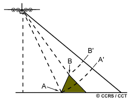

# Terrain Normalization

|Parameter|Type|Accepted Values|Description|
|-----------|-------|-------|------|
|dem |string | The GEE snippet of any DEM dataset |Digital elevation Model used for terrain corrections.
| terrain_flattening_model|string|'VOLUME', 'DIRECT'| The flattening model to be used.|
| terrain_flattening_additional_layover_shadow_buffer|integer|$i\in\R+$| Layover and shadow buffer distance.|

## Terrain Flattening Model

When applying a flattening model, there are 2 option proposed in this repo.

### DIRECT

The Direct model assumes the SAR backscatter comes mainly from surface reflections, ie **direct** reflections.

It results in aggressive correction which is ideal for bare surfaces like rock or soil.

### VOLUME

The Volume model assumes the SAR backscatter comes from canopy and other volumetric scatteres.

The correction is

## DEM

Digital Elevation Model used as a reference of terrain elevation to flatten the images. Be warry that resolution varies accross DEMs which can impact the quality of the flattened images.  

## Layover & Shadow Artifacts

There are 2 issues that can occure with SAR projections:
### Layover

Layover occurs when the radar beam reaches the top of a tall feature (B) before it reaches the base (A).

The return signal from the top of the feature will be received before the signal from the bottom. As a result, the top of the feature is displaced towards the radar from its true position on the ground, and "lays over" the base of the feature (B' to A'). [(ref)](https://natural-resources.canada.ca/maps-tools-publications/satellite-elevation-air-photos/radar-image-distortions)

### Shadow

When the radar can not reach parts of slops, that results in shadow areas that are devoid of data.

### The Buffer

The Buffer serves as a distance safety margine around the Layover and Shadow artifacts to ensure no pixels suffering from these artifacts are included in the final image. This will however result in nan holes in the final processed images.  